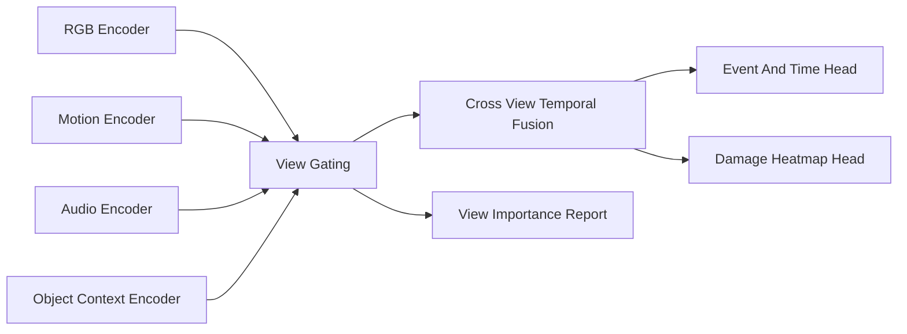

# Model Architecture

## Purpose

This document defines the PoC model family for predicting hydraulic-press failure precursors and post-failure damage heatmaps from pre-failure video. The design intentionally starts with interpretable baselines, then adds DMVC components only where they can be evaluated through ablation.

## Prediction Tasks

The model receives an input clip ending before or at the predicted pre-failure interval. It produces:

- `pre_failure_probability`: Probability that the current temporal window contains a failure precursor.
- `break_within_k_probability`: Probability that irreversible failure starts within a fixed horizon `K`.
- `time_to_break`: Estimated seconds until `t_break`.
- `damage_heatmap_2d`: Pixel-level probability map for the post-failure damaged region.
- `view_importance`: Per-view contribution scores for RGB, motion, audio, and object context.

The first PoC uses horizons `K = 0.5s`, `1.0s`, and `2.0s`.

## Input Views

### RGB View

Input:

- Uniformly sampled frames from the pre-failure window.
- Object-centered crop when an object mask or bounding box is available.
- Full-frame fallback when object localization is unavailable.

Encoder options:

- Minimal baseline: ResNet or EfficientNet frame encoder with temporal pooling.
- Strong baseline: Video Swin, TimeSformer, or SlowFast encoder.

### Motion View

Input:

- Optical flow.
- Frame difference.
- Object boundary displacement.
- Local deformation proxy around the press-object contact area.

Encoder options:

- Lightweight 2D CNN over stacked flow or frame-difference maps.
- Temporal convolution over flow energy and boundary displacement features.

### Audio View

Input:

- Mono waveform.
- Log-mel spectrogram.
- STFT energy bands.
- Onset envelope and high-frequency transient features.

Encoder options:

- CNN over log-mel spectrogram.
- Audio Spectrogram Transformer for later expansion.

Audio quality must be encoded with an `audio_confidence` scalar. Background music, voiceover, or missing audio should reduce the influence of this view rather than forcing the model to use it.

### Object Context View

Input:

- `object_material`
- `object_geometry`
- `failure_mode` if available for supervised training only, not for inference on unknown test clips.
- Text-derived weak features from title/description for candidate triage, not as a strict evaluation dependency.

Encoder options:

- Small embedding table for controlled vocabulary fields.
- Text embedding as optional weak context only when leakage rules allow it.

## Baseline Ladder

The PoC must train models in this order:

1. `rgb_temporal_baseline`: RGB encoder with temporal pooling and event heads.
2. `rgb_motion_baseline`: RGB plus motion features with late fusion.
3. `rgb_audio_baseline`: RGB plus audio with late fusion and audio confidence gating.
4. `tri_modal_baseline`: RGB, motion, and audio with fixed late fusion.
5. `dmvc_poc`: View gating, view dropout, diversity loss, and temporal alignment loss.

Each step must reuse the same train/validation/test split so performance changes can be attributed to the added view or loss.

## DMVC Fusion Design

The DMVC model has four stages:

1. View encoders produce normalized latent vectors per temporal window.
2. A gating network estimates per-view weights from latent quality indicators.
3. A fusion transformer attends across views and time.
4. Task heads predict precursor timing, time-to-break, and damage heatmap.

## Core View Combination

The model should not train every possible view combination explicitly. Instead:

- Apply view dropout during training so the model learns missing-view robustness.
- Use a sparse gating penalty to encourage a small set of useful views per sample.
- Log view weights by material, geometry, and failure mode.
- Compare selected view sets against fixed ablation models.

Expected behavior:

- Brittle objects should often emphasize RGB, motion, and audio transients.
- Ductile deformation should emphasize RGB and motion over audio.
- Noisy edited clips should reduce audio weight.
- Object context should improve calibration, not dominate predictions.

## Diversity And Alignment

The loss combines supervised task losses with representation constraints:

`L_total = L_event + L_time + L_heatmap + lambda_align * L_align + lambda_div * L_div + lambda_sparse * L_sparse`

Where:

- `L_event`: Binary cross entropy for precursor and `break_within_k` labels.
- `L_time`: Smooth L1 loss for time-to-break.
- `L_heatmap`: Dice plus focal loss for 2D damage heatmap.
- `L_align`: Temporal contrastive loss aligning different views around the same physical event.
- `L_div`: Redundancy penalty so views do not collapse into identical embeddings.
- `L_sparse`: L1 or entropy penalty on view gates for efficient core view selection.

PoC sweep:

- `lambda_align`: `0.0`, `0.05`, `0.1`, `0.2`
- `lambda_div`: `0.0`, `0.01`, `0.05`, `0.1`
- `lambda_sparse`: `0.0`, `0.001`, `0.005`

## Damage Heatmap Head

The first head predicts a 2D soft heatmap in the pre-failure object crop coordinate system. The heatmap is evaluated against the post-failure damage mask warped or resized to the same coordinate system.

2.5D extension:

- Estimate depth or use a canonical proxy mesh.
- Project 2D heatmap probabilities onto the visible object surface.
- Store projected outputs as `projected_heatmap_uri` in the dataset schema.

This extension is not a blocker for PoC success; it is a demonstration bridge toward the later 3D heatmap goal.

## Leakage Controls

The model must not use future frames after the inference cutoff. Training windows should be sampled so every input ends before `t_break` for precursor prediction and damage forecasting.

Strict evaluation must exclude:

- Post-failure frames from input.
- Failure mode labels as inference input.
- Clips sharing a channel or capture session across train and test.
- Text metadata that directly reveals the outcome when evaluating visual/audio generalization.

## Minimum Implementation Interfaces

The future code implementation should expose these interfaces:

- `DatasetItem`: loads synchronized RGB, motion, audio, context, event labels, and masks.
- `ViewEncoder`: returns a latent sequence and quality indicators for one view.
- `ViewGater`: returns normalized and sparse view weights.
- `DMVCFusion`: fuses view latents across time.
- `EventHead`: predicts precursor probability and time-to-break.
- `DamageHead`: predicts 2D heatmap.
- `AblationRunner`: trains and evaluates the baseline ladder with identical splits.
