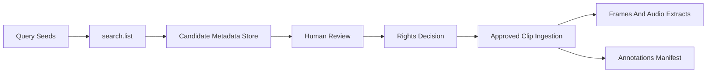

# YouTube Data Collection And Operations

## Purpose

This document defines how the project discovers YouTube candidates through the official API, manages metadata, gates rights before storing audiovisual training clips, and structures storage so datasets remain auditable and policy-aligned.

It complements `01_data_acquisition_policy.md` with operational detail for engineers running ingestion jobs.

## Principles

1. Discover candidates with YouTube Data API metadata only until rights are approved.
2. Never commit raw audiovisual assets or API secrets to git.
3. Separate candidate metadata from approved training assets at the filesystem and database level.
4. Track provenance: source video ID, fetch time, reviewer, rights evidence URI.
5. Refresh or delete stale metadata according to API storage guidance for non-authorized fields.

## Architecture Overview

## Directory Layout

Recommended repository-local layout under `data/` (all ignored by `.gitignore` except sanitized samples):

| Path | Contents |
| --- | --- |
| `data/candidates/` | Raw API JSON responses or normalized CSV/Parquet exports |
| `data/candidates/samples/` | Small sanitized examples safe to commit for CI fixtures if needed |
| `data/rights/` | Permission emails, PDFs, consent logs (never commit without legal review) |
| `data/approved_clips/` | Segmented clips authorized for training |
| `data/frames/` | Extracted frames per clip ID |
| `data/audio_extracts/` | Mono WAV segments aligned to clips |
| `data/manifests/` | Clip-level manifests validated against `schemas/dmvc_clip.schema.json` |

Keep machine-readable manifests versioned in git only when they contain no secrets and represent public fixtures.

## Candidate Metadata Ingestion

### API Usage

- Use `search.list` with bounded queries and pagination limits to respect quota (each search costs quota units).
- Use `videos.list` to enrich IDs with duration, definition, caption availability, and licensing hints.
- Store `etag`, `api_fetched_at`, and `metadata_refresh_due_at` per record.

### Normalized Candidate Record

Minimum fields:

- `video_id`
- `title`, `description_snippet`
- `channel_id`, `channel_title`
- `published_at`
- `duration_iso8601`
- `license_filter_used` (`creativeCommon` vs default search)
- `embeddable`, `syndicated` when available
- `rights_status` (`pending_review`, `standard_only_queue`, `approved_for_training`, `rejected`)
- `review_notes`

### Quota And Rate Limits

- Batch requests; backoff on HTTP 403 quota errors.
- Log quota consumption per run.
- Schedule incremental refresh rather than full rescans.

## Rights Gate Before Audiovisual Storage

Training clips may be ingested only when `rights_status` is one of the approved states in `01_data_acquisition_policy.md`.

Workflow:

1. Candidate enters `pending_review`.
2. Reviewer applies exclusion criteria from the policy doc.
3. For standard-license videos, contact creator or skip automatic ingestion.
4. On approval, attach `rights_evidence_uri` (stored outside git or in private encrypted storage).
5. Promote to `approved_for_training` and assign `clip_id`.

## Approved Clip Ingestion

After approval:

1. Download or capture **only** the authorized segment (not necessarily the full YouTube video when partial rights apply).
2. Store under `data/approved_clips/<clip_id>/source.ext`.
3. Extract frames and audio with deterministic parameters documented per clip (FPS, crop box).
4. Write `data/manifests/<clip_id>.json` conforming to `schemas/dmvc_clip.schema.json`.

Never mix approved assets with candidate-only metadata directories.

## Secrets And Configuration

Store API keys and OAuth client secrets in:

- CI: GitHub Actions encrypted secrets (`YOUTUBE_API_KEY`, etc.) — only when workflows need API calls.
- Local dev: `.env` (gitignored) or OS keychain.

Repository code must read secrets from environment variables, never hard-coded strings.

## Retention And Deletion

- When a creator revokes permission, delete approved clips and derived artifacts within the timeframe promised in your consent terms.
- Refresh YouTube metadata snapshots according to API policies for cached API data.
- Maintain an deletion audit log with object paths removed.

## Sanitized Public Fixtures

If the repository needs tiny committed fixtures for tests:

- Use synthetic clips or Creative Commons snippets with explicit license file.
- Strip identifying metadata from filenames when publishing examples.

## Operational Checklist

- [ ] API project quotas documented and monitored.
- [ ] Candidate DB deduplicates `video_id`.
- [ ] Review queue assigns owners and SLA.
- [ ] Approved clips have manifests with split groups for leakage-safe evaluation.
- [ ] No raw training media paths referenced in public issues or logs.
